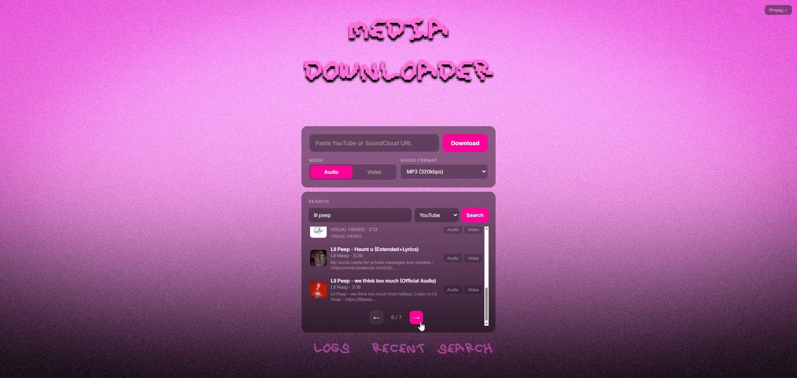
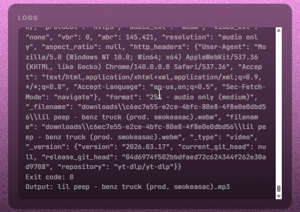
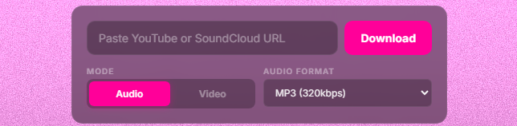

# Emo Media Downloader — YouTube & SoundCloud
> Built with Opencode CLI

> Локальный веб-сервис для поиска и скачивания аудио/видео с **YouTube** и **SoundCloud**.
>
> Синтвейв-интерфейс, максимальное качество, одна команда для запуска.

<p align="center">
  
</p>

> Локальный веб-сервис для поиска и скачивания аудио/видео с **YouTube** и **SoundCloud**.
>
> Синтвейв-интерфейс, максимальное качество, одна команда для запуска.

<p align="center">
  
</p>

---

## Возможности

- **Поиск** YouTube и SoundCloud прямо в браузере (до 50 результатов, пагинация стрелками)
- **Аудио**: скачивание в MP3 320kbps (с ffmpeg) или в родном формате (без ffmpeg)
- **Видео**: скачивание в MP4 до 4K (с ffmpeg) или best quality single stream (без ffmpeg)
- **SoundCloud**: поиск и скачивание, только аудио
- **Авто-определение**: YouTube ссылка, SoundCloud трек/плейлист
- **Тёмная синтвейв-тема**: magenta-to-black градиент, неоновая эстетика
- **Логи в реальном времени**: вкладка Logs, обновление каждую секунду
- **История загрузок**: вкладка Recent со списком всех скачанных файлов
- **ffmpeg**: авто-детект, без ffmpeg — родные форматы (opus/m4a), с ffmpeg — MP3 320kbps и MP4 4K
- **Окружение**: Python FastAPI + yt-dlp, всё в одной папке, без Docker

<p align="center">
  
</p>

---

## Установка (Windows)

### 1. Требования

- **Python 3.11 или 3.12** [скачать](https://www.python.org/downloads/)
- **(Опционально) ffmpeg** — для MP3 320kbps и 4K видео. Если не установлен — работает в родных форматах

### 2. Быстрый старт

```cmd
install.bat
run.bat
```

`install.bat` создаёт виртуальное окружение, устанавливает зависимости (FastAPI, yt-dlp) **и скачивает ffmpeg** (~10MB) в `app/ffmpeg.exe`.

`run.bat` запускает сервер.

Открой браузер → **http://127.0.0.1:8080**

### 3. Установка ffmpeg

ffmpeg устанавливается **автоматически** через `install.bat`. Если не сработало:

- Запусти `install-ffmpeg.bat` из папки проекта
- Или скачай `ffmpeg.exe` вручную и положи в `app/ffmpeg.exe`
- Или установи глобально и добавь в `PATH`

<p align="center">
  
</p>

---

## Как пользоваться

### Поиск

1. Переключись на вкладку **SEARCH** (снизу)
2. Выбери YouTube или SoundCloud
3. Введи запрос, нажми Enter или Search
4. Листай результаты стрелками ← →
5. Нажми **Audio** или **Video** под результатом

### Скачивание по ссылке

1. Вставь ссылку в верхнее поле (YouTube или SoundCloud)
2. Выбери режим: **Audio** (MP3) или **Video** (MP4)
3. Нажми **Download**
4. Следи за прогрессом во вкладке **LOGS**
5. Готовый файл появится во вкладке **RECENT**

### Настройки форматов

- **Audio**: MP3 320kbps (с ffmpeg) / best audio (без ffmpeg)
- **Video → MP4**: best video + best audio, до 4K (с ffmpeg) / best stream (без ffmpeg)
- **Video → MP3**: извлечение аудио из видео в MP3

<p align="center">
  
</p>

---

## Конфигурация

Файл `.env` в корне проекта:

```env
HOST=127.0.0.1
PORT=8080
DOWNLOAD_DIR=downloads
```

---

## Структура проекта

```
MediaDownloader/
  app/
    main.py          # FastAPI сервер
  static/
    index.html       # UI
    style.css        # Синтвейв-тема
    app.js           # Клиентская логика
    logo.png         # Логотип
    background.png   # Фоновое изображение
    logs-button.png  # Кнопка LOGS
    recent-button.png
    search-button.png
  design/            # Исходники дизайна
  downloads/         # Скачанные файлы (создаётся автоматически)
  venv/              # Виртуальное окружение
  .env               # Конфиг
  install.bat        # Установка зависимостей
  run.bat            # Запуск сервера
  requirements.txt   # Зависимости Python
```

---

## Где скачанные файлы

Все загрузки сохраняются в папку `downloads/<job_id>/`.
Каждая загрузка — отдельная папка с файлом и `download.log`.

Открой вкладку **RECENT** — там список всех загрузок с ссылками на файлы.

---

## Обновление yt-dlp

```cmd
.\venv\Scripts\python.exe -m pip install -U yt-dlp
```

---

## Скриншоты

| # | Что показать | Файл |
|---|-------------|------|
| 1 | **Полный экран** — лого, поиск, интерфейс | `screenshots/searchfull.jpg` |
| 2 | **Логи / Процесс** | `screenshots/logs.png` |
| 3 | **ffmpeg статус** | `screenshots/ffmpeg.png` |

---

## Лицензия

MIT
